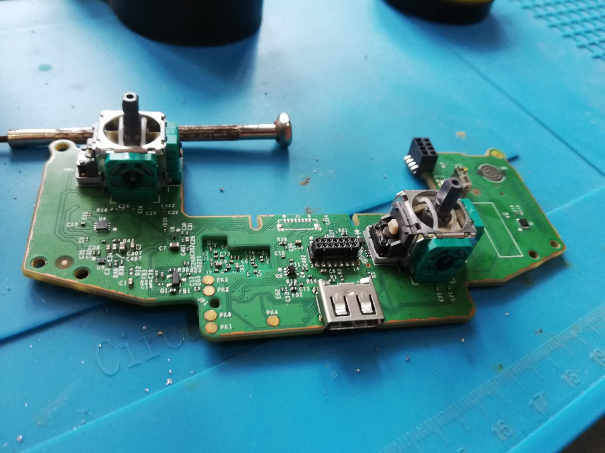
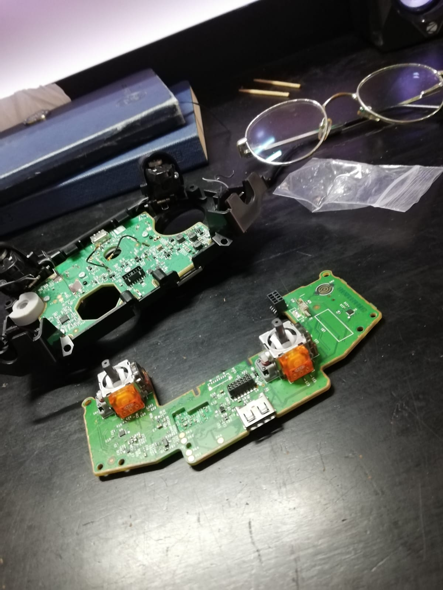
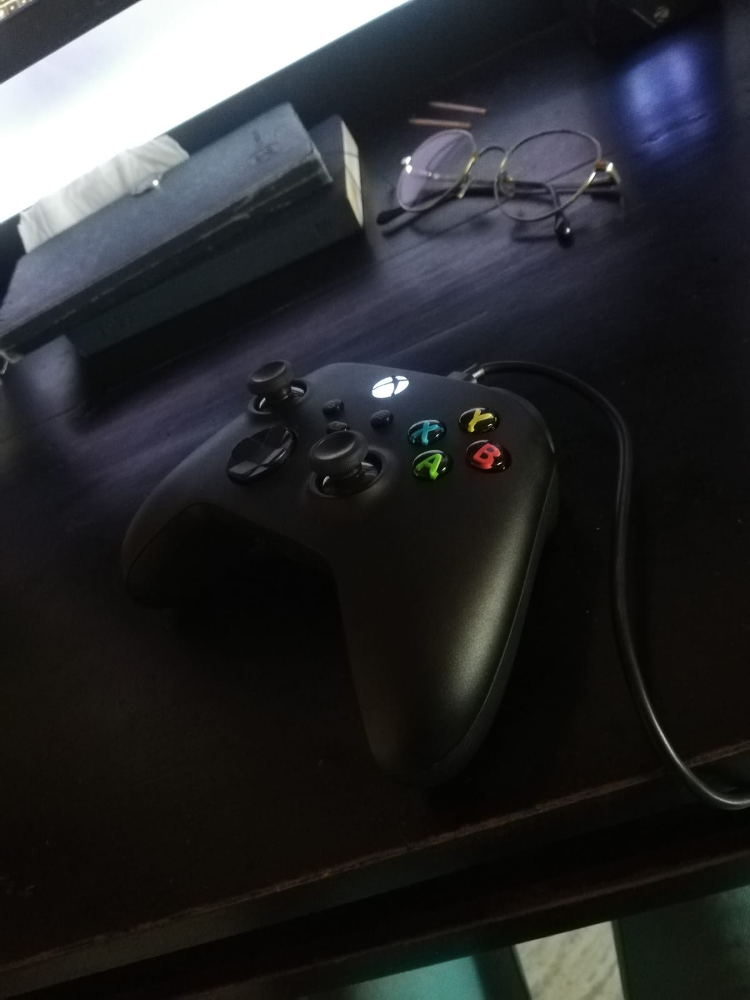
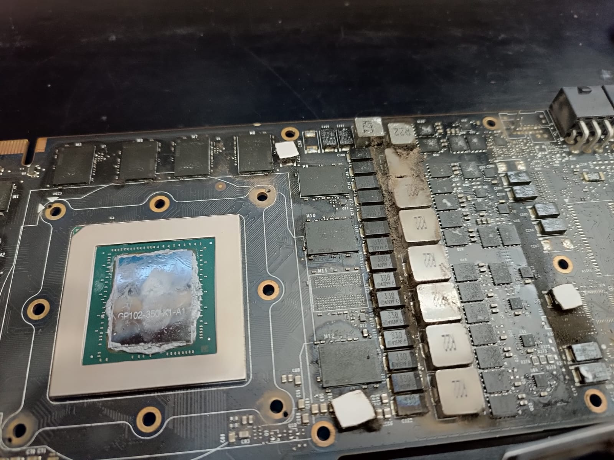
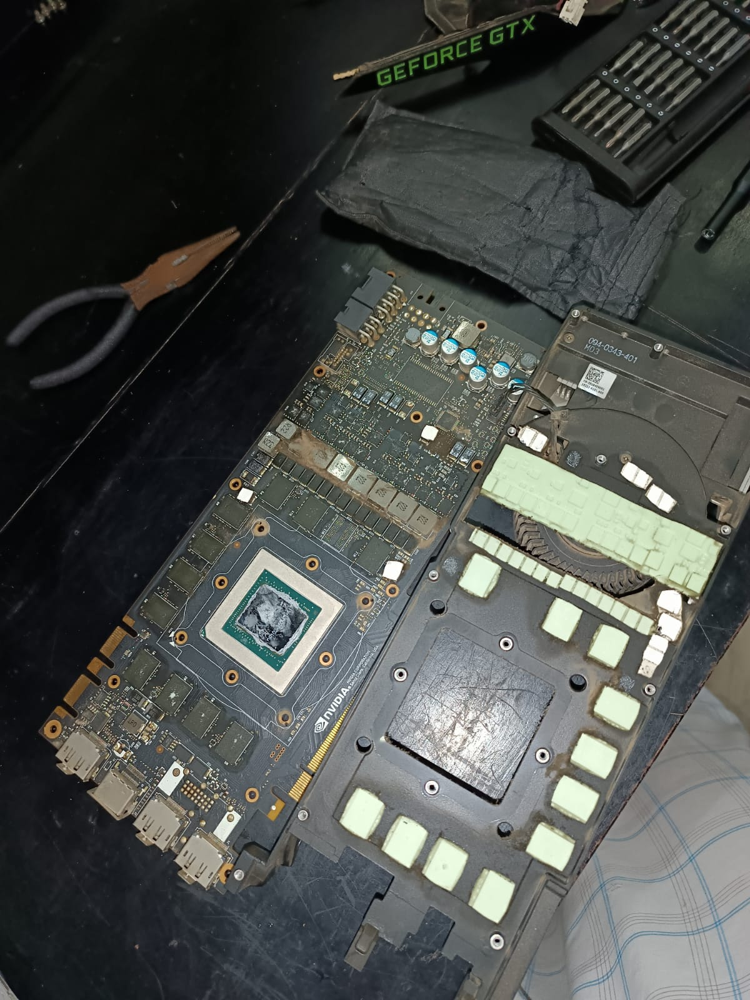
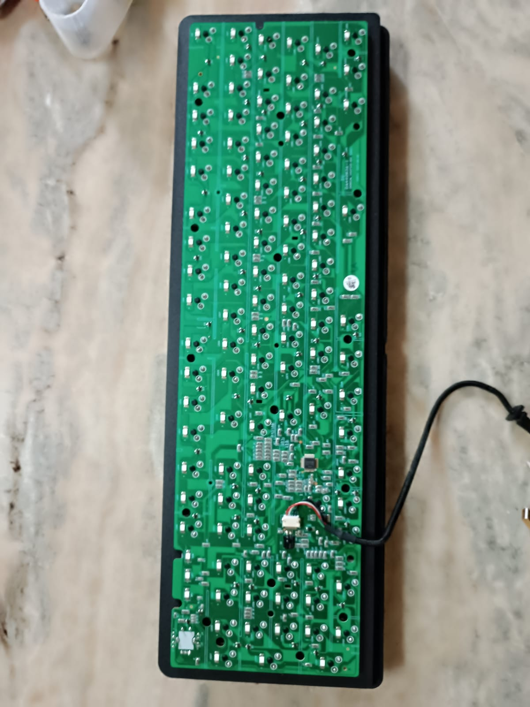
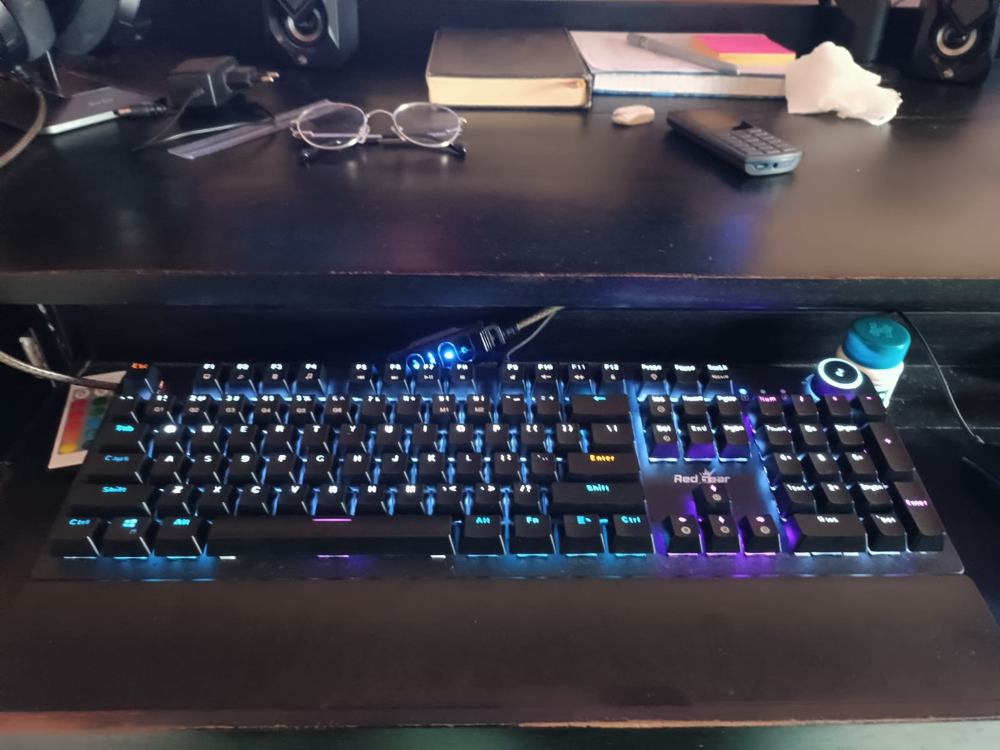
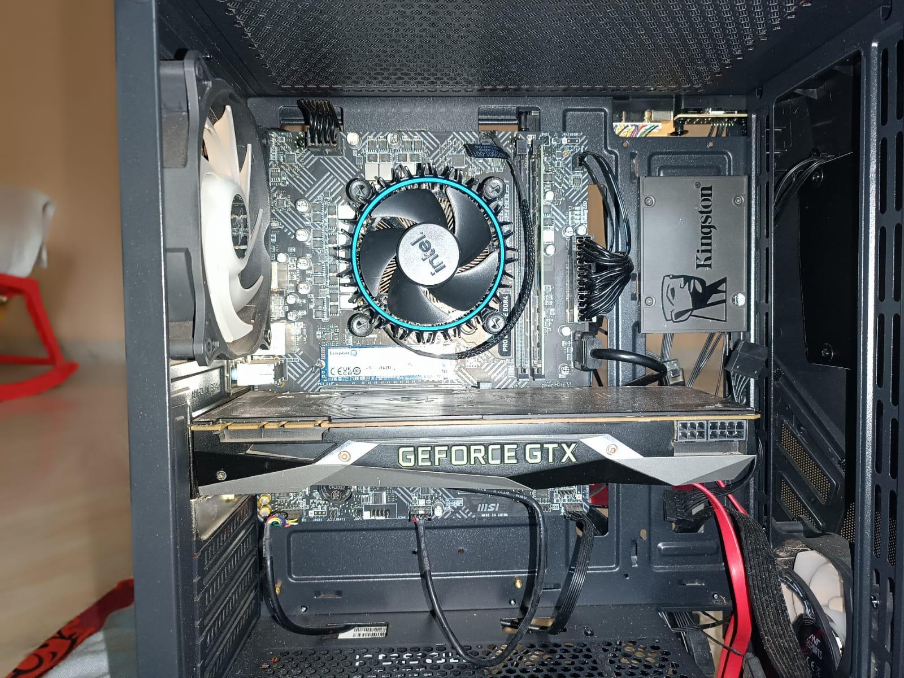

# Hardware Repairs & PC Builds

Board-level diagnosis, rework and thermal service on consumer electronics, plus custom PC builds.
Ongoing since 2024 — mostly for friends, mostly out of interest.

No code here. This repo documents the other half of electronics: finding a fault in something you
didn't design, and fixing it without a schematic.

---

## Xbox Series X controller — repair + TMR joystick upgrade

The most involved job here. The controller had drifting analog sticks — the standard failure of
potentiometer-based joysticks, where the resistive track wears and the neutral position stops
reading as neutral.

Rather than replace like-for-like and wait for the same failure again, I swapped in **TMR
(tunnelling magnetoresistance) joystick modules**. These sense stick position magnetically instead
of through a wiper on a carbon track. Nothing touches, so nothing wears — which removes the cause
of drift rather than resetting its clock.

*Teardown. Stock potentiometer sticks desoldered from the main board.*

*TMR modules soldered in — the orange units. Both boards shown before reassembly.*

*Reassembled and tested.*

**Work involved:** full teardown, desoldering the original stick modules without lifting pads,
fitting and soldering the replacements, reassembly, and verifying centring and full-range travel.

---

## NVIDIA GTX 1080 Ti — service and inspection

Teardown, deep clean, thermal-paste and thermal-pad replacement, and board-level inspection for
faults. Thermal pads harden and lose conductivity over time, so on a card of this age the VRM and
memory pads matter as much as the die paste.

*As received.*

*Stripped down for cleaning and repaste.*

---

## Keyboard repair

A non-working keyboard, diagnosed and brought back.

<table>
<tr>
<td></td>
<td></td>
</tr>
<tr><td align="center"><em>Before</em></td><td align="center"><em>After</em></td></tr>
</table>

---

## Custom desktop PC build

Full build from selected components, assembled and commissioned, including Linux setup.

---

## What this work involves

| | |
|---|---|
| **Fault isolation** | Multimeter and oscilloscope, working without schematics |
| **Soldering & rework** | Through-hole and surface-mount, component-level replacement |
| **Thermal service** | Teardown, cleaning, repaste, thermal-pad replacement |
| **Assembly** | Component selection, building, OS and driver setup |

**10+ consumer devices** repaired at board level so far — PCs, gaming controllers, displays and
home electronics.

Not every job succeeds. One recent attempt didn't come back, which is part of the work: some
faults aren't economically or practically recoverable, and knowing when to stop is a skill too.

---

*Ongoing. New jobs get added as they come in.*
